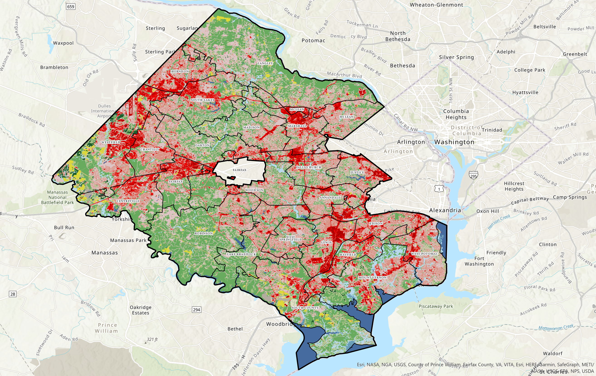

```{r setup, include=FALSE}
knitr::opts_chunk$set(echo = TRUE)
```


# Fairfax County Public Schools




## What do we see here?
Fairfax county is an unusual county
surrounding Washington DC, Prince
William County, and Loudon County. It
varies in land use in 2016. All the way from
Deciduous forests to Highly developed
areas. There are many high schools
encompassed in the Fairfax county
boundary each school district having a
unique make up of land uses.

<a href="Layout1.pdf">See Layout</a>

## Schools & Statistics
```{r echo = F}
X = read.csv("School_Stats.csv")
Y = read.csv("Class.csv")
X2 = X[,c(2,3,5,13)]
X2$Area_Miles = round(X2$AREA*0.000001*0.621371,2)
X2 = X2[,c(-2)]
X2$Class_ID = X2$MAJORITY
X2 = merge(X2, Y, by = "Class_ID")
X2 = X2[,c(-1,-3,-4)]
X2$Name = X2$SCHOOL_NAM
X2$Area.SqMiles = X2$Area_Miles
X2$Majority_LandUse = X2$Class_Name
X2 = X2[,c(4,5,6)]
library(DT)
X3 = datatable(X2)
X3
```

